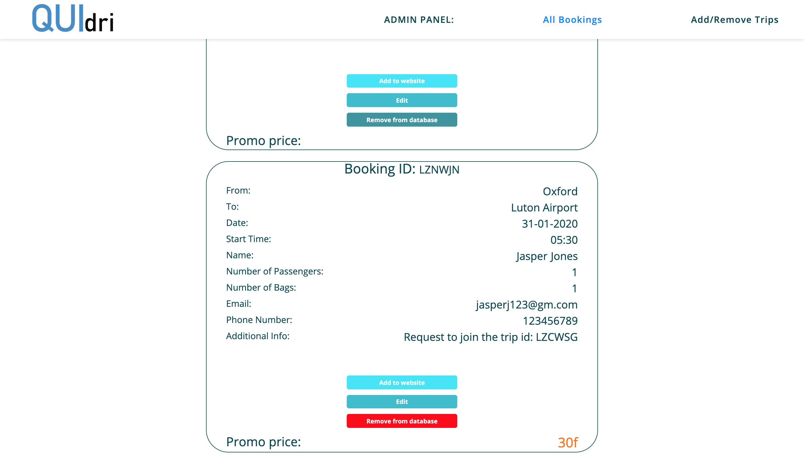

# Quidri-transport

Website and admin panel for company owner.

Website allows people to book a transport or join any trip that's listed.

Admin panel allows a company owner/employee to: 
- see each booking that come from the website form.
- list any transport from the database on the website by clicking one button and providing a price,
so other people could join this specific transport.
- edit additional info about a passangers (ex. to mark if this specific booking is confirmed).
- see if the booking is a first request or request to join an existing booking.
- delete any booking from database.
- edit or delete trips from website.

## Used: 
- HTML
- CSS
- SASS
- jQuery
- JavaScript

also:
- Gulp
- Firebase
- Json server (initially)

## Website 

  

### Check if someone is heading to the same direction!

  

  

### If you find the suitable ride just click on it, fill in the short form and submit. Data is stored and will appear on the admin panel with the information that this is a request to join a specific ride.

  

### If you can't find any suitable dates, just fill in the main booking form. You still have a chance to get promotional price if admin decides to list your trip on the website and someone joins!

  

## Admin Panel 

### Admin can filter all bookings and list them on the website to get more people. Just click 'add to website' and enter the promo price.

  

### When the ride is finished or not confirmed, admin can remove booking from the database.

  

### It's also possible to add the trip to the website manually. E.g. If booking doesn't come from website and company owner decides to list it.

  

### Each ride can be easly edited or removed from the website. Edit function is useful when the customer is giving the full address and admin wants to add this specific ride to website.

 

## Preview:

Here you can check all the functionality of this application. From booking trips on the website to managing them in the admin panel.

Check the preview of the <b>WEBSITE</b> here: *https://kacpermak1.github.io/Quidri-transport/*

Check the preview of the <b>ADMIN PANEL</b> here: *https://kacpermak1.github.io/Quidri-transport/admin_panel.html*