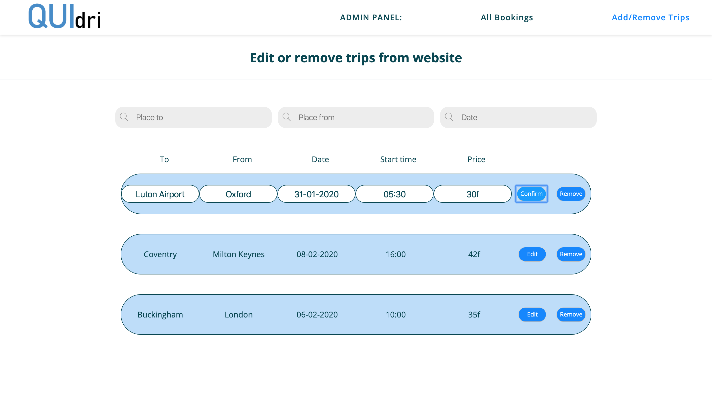

# Quidri-transport

Website and admin panel for company owner.

Website allows people to book a transport or join any trip that's listed.

Admin panel allows a company owner/employee to: 
- see each booking that come from the website form.
- list any transport from the database on the website by clicking one button and providing a price,
so other people could join this specific transport.
- edit additional info about a passangers (ex. to mark if this specific booking is confirmed).
- see if the booking is a first request or request to join an existing booking.
- delete any booking from database.
- edit or delete trips from website.

## Used: 
- HTML
- CSS
- SASS
- jQuery
- JavaScript

also:
- Gulp
- Firebase
- Json server (initially)

## Website

 

 

 

 

## Admin Panel

 

 

 

## Preview:

Here you can check all the functionality of this application. From booking trips on the website to managing them in the admin panel.

Check the preview of the <b>WEBSITE</b> here: *https://kacpermak1.github.io/Quidri-transport/*

Check the preview of the <b>ADMIN PANEL</b> here: *https://kacpermak1.github.io/Quidri-transport/admin_panel.html*
